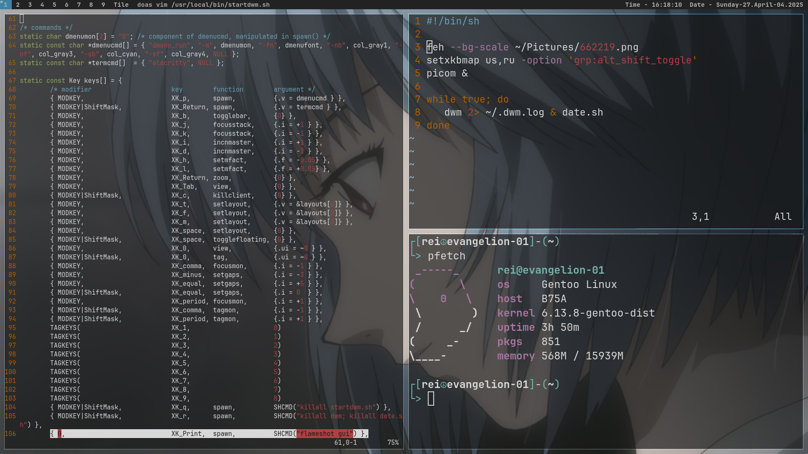
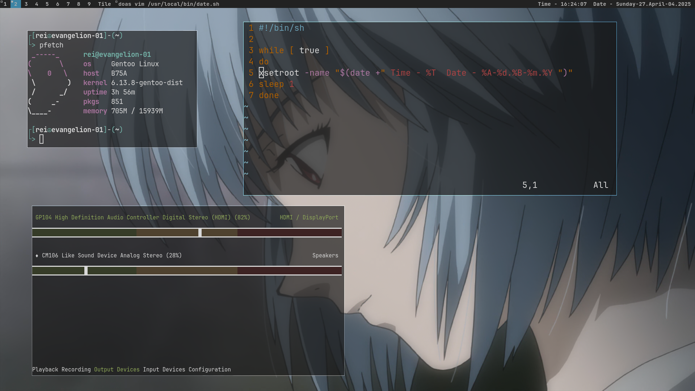

# dwm-rei
suckless's dwm rei theme

## info





you can see:
- dwm
- alacritty
- picom
- flameshot
- pfetch
- dmenu
- ncpamixer

## install
install with your packet manager alacritty, picom and make

debian(-based):
```bash
sudo (doas) apt install alacritty picom make
```
arch(-based):
```bash
sudo (doas) pacman -S alacritty picom make
```

copy startdwm.sh and date.sh to /usr/local/bin/

enter to terminal:
```bash
git clone https://github.com/0krohska/dwm-rei
cd dwm-rei/dwm
sudo (doas) make install
```

if you use display manager, copy dwm.desktop to /usr/share/xsessions/ and login with "dwm" session
```bash
cd .. # to "dwm-rei"
sudo (doas) cp dwm.desktop /usr/share/xsessions/
```

if you use xinit (startx), write to ~/.xinitrc "exec /usr/local/bin/startdwm.sh" 
```bash
echo "exec /usr/local/bin/startdwm.sh" >> ~/.xinitrc
```

copy 662219.png to ~/Pictures/
```bash
mkdir ~/Pictures # if haven't
cp 662219.png ~/Pictures/
```

copy "alacritty" and "picom" folders to ~/.config/
```bash
cp -r alacritty picom ~/.config
```
